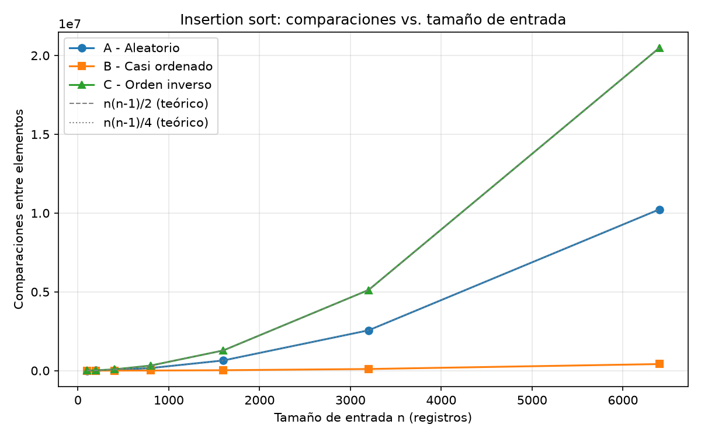
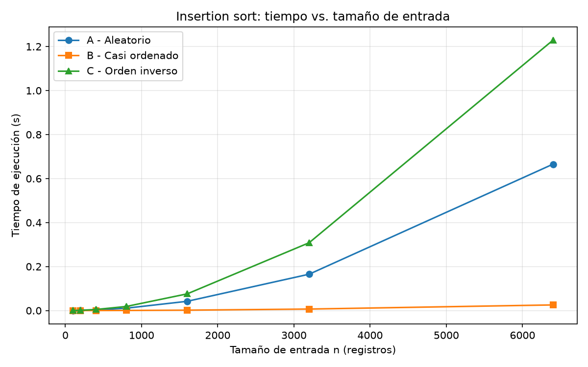
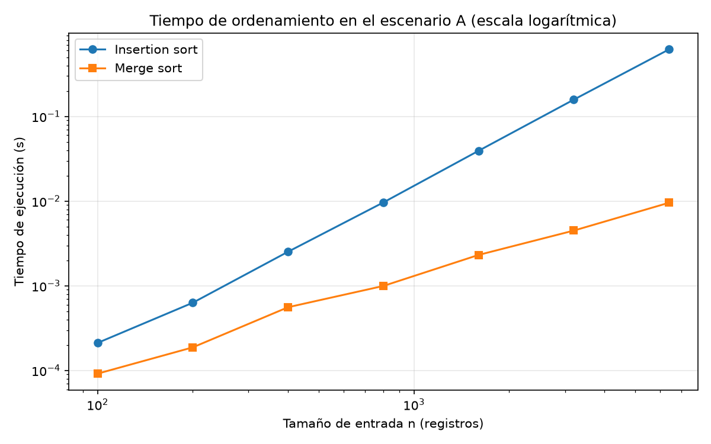
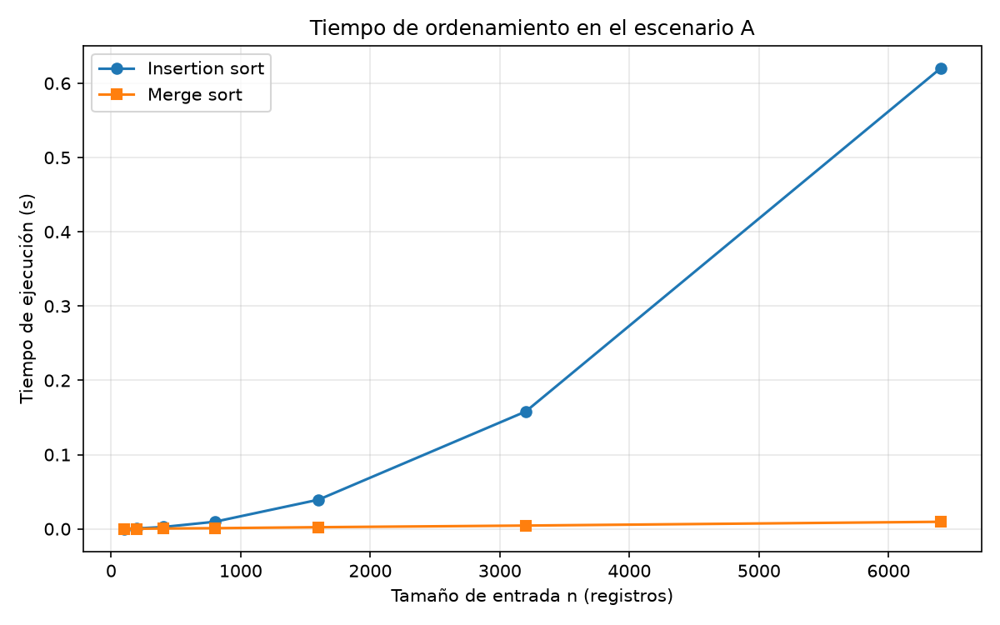

# Desarrollo del Laboratorio

## Parte 1

Inicialmente vemos un **algoritmo correcto** pero que actualmente no está siendo viable debido a que la cantidad de registros `"n"` pasó de **20.000 a 1.200.000** y no se están ordenando todos los datos en el tiempo definido de **4 horas**, es decir, `n` creció **x60**, es necesario buscar la forma de cambiar el algoritmo de **insertion sort** que crece en `n²`.

El tiempo del algoritmo creció **x3.600** y se ejecutó durante **8 años** y actualmente no logra ordenar todos los datos en las **4 horas definidas** debido a la expansión en todos los laboratorios del departamento y por ende, la cantidad de registros aumentó.

Se busca mejorar la ejecución realizando una actualización del algoritmo a **merge sort** que trabaja con `n log n`, el tiempo se multiplicaría solo **x85** `60 × log₂(1.200.000) / log₂(20.000) ≈ 60 × 1,41` y así buscar mejorar el **tiempo de CPU** para que los datos puedan ser ordenados entre las **2:00 a. m. y las 6:00 a. m.**

Duplicar la capacidad del servidor implica tener una **máquina mucho más veloz** para lograr llegar a una solución temporal pero que va a generar **gastos de recursos monetarios frecuentemente** cada vez que `n` crezca y por otro lado, **afectaciones al medio ambiente por el alto consumo energético**.

### Ejemplo

Al consultar los productos en un **ecommerce**, la carga de productos era demasiado lenta y tardaba más de **15 segundos** en mostrar los resultados. En este caso, el algoritmo pudo haber sido correcto; sin embargo, al ser tantos productos a mostrar, siempre tardaba en cargar los resultados.

La tienda tiene aproximadamente más de **1.000 productos** cargados en el sistema, por lo que cada búsqueda tendrá diferentes tiempos según cuántos productos tenga asociados la categoría seleccionada.

### Resultado

Por esta razón, muchos ecommerce pierden clientes; actualmente migraron la tienda a **Shopify** y es mucho más ligero.

## Parte 2

### Responsabilidad ambiental y ética de la implementación
Es necesario encontrar la forma de ordenamiento más óptima para tener un sistema más eficiente y que consuma menos recursos; de esta forma no se van a ver elevados el factor económico, ambiental y de experiencia de usuario.

### Ambiental: 
Cada operación que se realiza requiere cierto consumo de recursos computacionales; por lo tanto, esto lleva a tener más consumo de energía y, si existen algoritmos obsoletos como **insertion sort**, que crece de manera cuadrática y que trabajaba con **20.000** registros y ahora se exige que procese **1.200.000** registros en el mismo lapso de tiempo, en este caso el procesador, la memoria y otros componentes van a estar más tiempo activos consumiendo energía diariamente cada que se realice el proceso.

### Ética:
La ineficiencia de un algoritmo que inicia la ejecución a las **2 a. m. hasta las 6 a. m.**, pero no se logra procesar al **100%**. En este caso, el ordenamiento queda incompleto y quedan pacientes de alto riesgo sin ordenar; el costo inmediato lo asume el paciente debido a que requiere atención prioritaria y no ha podido ser contactado. El desarrollador asume una responsabilidad muy alta que también puede perjudicar a la entidad, debido a que no hay garantías de que el software esté funcionando correctamente y esto puede traer consecuencias perjudiciales para ellos y la entidad.

### Económico: 
Si se piensa en mejorar las capacidades del servidor para mitigar el problema, es incurrir en un gasto más elevado por mes y esta solución sería temporal, ya que si ingresan más datos de los esperados, es necesario volver a pagar por más capacidad.

## Parte 3.1 - Explicación

### Lista de casos

1. **Peor caso** `[830, 420, 231, 83, 55, 19, 1]` - Cuando la lista está ordenada de forma ascendente. En este caso se produce el mayor número de operaciones.
2. **Mejor caso** `[1, 19, 55, 83, 231, 420, 830]` - Cuando la lista está ordenada de forma descendente. En este caso se produce el menor número de operaciones.
3. **Caso promedio** `[83, 55, 420, 1, 830, 231, 19]` - Cuando la lista es aleatoria. En este caso se produce menor cantidad de operaciones debido a que hay valores que se ubican fácilmente en su posición.

Utilizaría para el algoritmo de Tamiza el peor caso, ya que es necesario procesar los pacientes con mayor índice de riesgo. Esto implica ajustar el código para que el ordenamiento sea descendente y así convertirlo en el mejor caso.

**NOTA:** Teniendo en cuenta que la lista debe quedar ordenada de forma descendente.
1. **Caso A - Descendente:** Para este caso representaría menos tiempo porque el 100% de los registros ya están ordenados para procesar los pacientes con mayor índice de riesgo.
2. **Caso B - Ascendente:** Para este caso representaría más tiempo, ya que los datos se tienen que reorganizar completamente para tener el orden solicitado.
3. **Caso C - Aleatorio:** Caso promedio, ya que los datos llegan sin ninguna relación con respecto al índice de riesgo.

## Parte 3.2 - Demostración experimental

### Mejor caso
CASO B - Con n= 6400 realizó 416.415 comparaciones en 0.029906 segundos
### Peor caso
CASO C - Con n= 6400 realizó 20.476.800 comparaciones en un tiempo de 1.228809 segundos
### Caso promedio
CASO A - Con n= 6400 realizó 10.228.989 comparaciones en un tiempo de 0.620007 segundos

## Parte 4.2 - Validación experimental

### Lectura de la gráfica:

La curva de insertion sort [se curva hacia arriba]. Al duplicar n, su tiempo se multiplica por casi [4]: de [t(3200)] s a [t(6400)] s. Es el comportamiento de n².
La curva de merge sort [casi no se separa del eje]. Al duplicar n, su tiempo se multiplica por un poco más de [2]: de [t(3200)] s a [t(6400)] s. Es el comportamiento de n log n.
Con n = 6.400, insertion sort tarda [R] veces más que merge sort, y esa razón crece con n.

### Conclusión. 

Para Tamiza conviene merge sort, porque en la propia gráfica [la brecha se abre a medida que crece n].

## Parte 4.3 - Concepto técnico para la Secretaría de Salud

### Asunto: 
algoritmo de ordenamiento del proceso nocturno de Tamiza

### Recomendación. 
Sustituir insertion sort por merge sort como única implementación. El canal de entrada puede cambiar sin aviso y no conviene mantener tres versiones, así que el criterio fue elegir el algoritmo cuyo costo no depende del orden de llegada. Insertion sort va de un tiempo lineal a uno cuadrático según el canal; merge sort mantiene el mismo orden de crecimiento (n log n) en los tres, y con eso el proceso deja de depender de un factor que nadie controla.

### ¿Cabe en la ventana de cuatro horas? 
Extrapolé desde n = 6.400, el mayor tamaño medido. Para insertion sort supuse T(n) = c·n² y multipliqué por (1.200.000 / 6.400)² ≈ 35.156. Para merge sort supuse T(n) = c·n·log₂ n y multipliqué por ≈ 299. 

### Servidor del doble de velocidad. 
En parte4_tiempo.png, con n = 6.400, insertion sort tarda [t_ins] s y merge sort [t_mer] s: una razón de [R]. El servidor nuevo divide cualquier tiempo por 2; el cambio de algoritmo lo divide por [R], y esa razón crece con n (con 1.200.000 registros sería unas 117 veces mayor que a 6.400, si se mantiene el modelo). Con el servidor nuevo, insertion sort quedaría en [estimado / 2] en el escenario [A/C]: [cabe / sigue sin caber]. Aun si cupiera, el margen es corto: como el tiempo crece con n², una máquina ×2 solo admite un 41 % más de registros antes de volver a desbordar.

### Otras consideraciones.

- **Memoria**. Merge sort necesita una copia adicional del lote (O(n)). Con 1.200.000 registros es un costo asumible; debe confirmarse en el servidor.
- **Estabilidad.** Ambos algoritmos son estables, así que los pacientes con el mismo índice conservan el orden de carga. Ese orden es arbitrario, y conviene que el equipo clínico defina un criterio de desempate explícito.
- **Riesgo del escenario B**. Insertion sort solo funciona bien mientras el reproceso entregue una lista casi ordenada. Si cambia ese flujo, el problema reaparece. Merge sort no depende de ello.
- **Verificación**. Cada noche conviene comprobar que la lista final es una permutación de la entrada y está en orden descendente. El orden decide a quién se llama primero.

